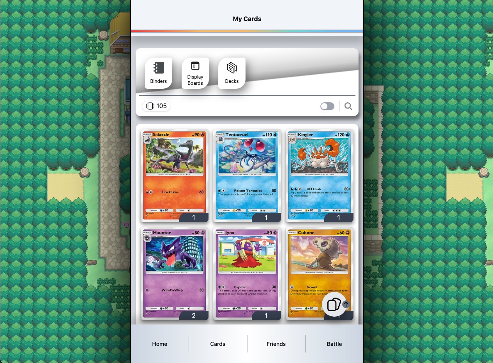
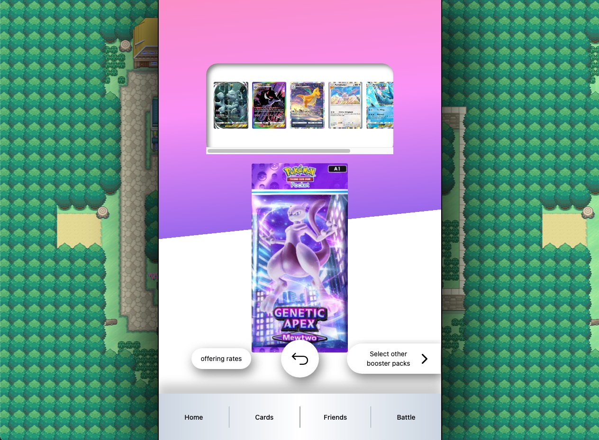
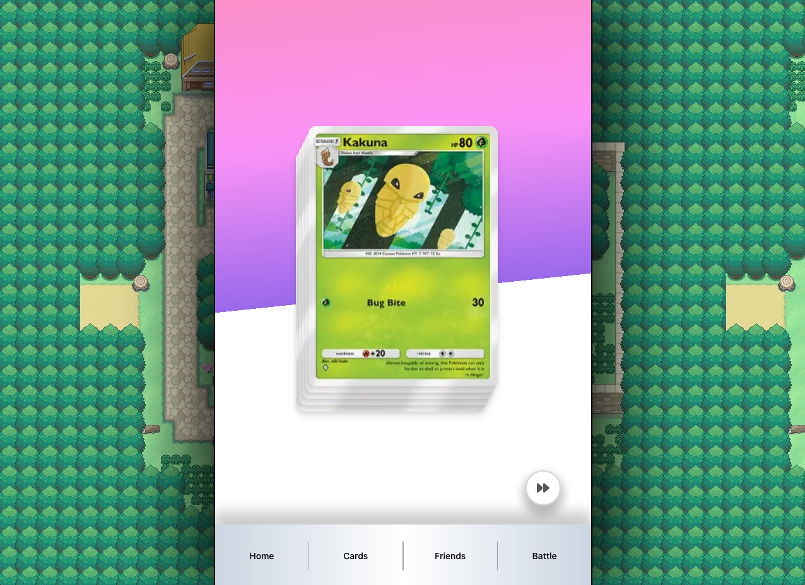

# Pokémon TCG Pocket (Frontend)

This is my personal development project that emulates the recent Pokemon TCG Pocket game in web version. The app allows users to open booster packs, collect cards, and track their collection.

**Project Link** - [click here!](https://pokemon-tcgp-jackytam.vercel.app/)

<div style="display: flex; justify-content: space-evenly;">
  
  
  
</div>

## Features

- **Authentication** - Users can sign up, log in, and stay logged in with an auth token. Expired tokens trigger automatic redirection
- **Booster Pack System** - Select and open booster packs to reveal new cards (currently have 7 booster packs available)
- **Collection Management** - View collected cards with sorting by card id, rarity, collected date, and quantity
- **Compare Cards** - Compare owned cards vs not owned cards in database
- **View Card Details** - View detailed card states, including HP, attacks, weaknesses, effects, illustrator name, evolutions and more

## Tech Stack

- **Framework**: [Next.js](https://nextjs.org/docs)
- **Language**: [TypeScript](https://typescriptlang.org)
- **Styling**: [Tailwind CSS](https://tailwindcss.com/docs/installation/using-vite)
- **UI Components**: [shadcn/ui](https://ui.shadcn.com/docs/installation)
- **Icons**: [Font Awesome](https://docs.fontawesome.com/)
- **Database**: PostgreSQL (via backend API)

## Installation & Getting Started

Prerequisites

- npm or yarn package manager

Install dependencies:

```
npm install
```

Create a `.env.development` file in the root folder with variabls:

```
NEXT_PUBLIC_PUBLIC_API_HOST=http://localhost:xxxx
```

Run the development server:

```
npm run dev
```

Open [http://localhost:3000](http://localhost:3000) with your browser to see the result.

## API Communication

This frontend interacts with a [**NestJS backend**](https://github.com/lejt/PokemonTCGP-Backend) through RESTful APIs. Ensure the backend is running for proper functionality.

## Future Enhancements

- **Deck Building**: Enable users to create and manage decks
- **Battle System**: Implement battle mechanics (need web sockets)
- **Trading feature**: Allow users to trade cards
- **Implement booster pack opening wall**: limit opening rate may encourage users to trade

## License

This project is for educational purposes. No official affiliation with Pokémon or Nintendo.

## Deploy on Vercel

This repo is deployed on [Vercel Platform](https://vercel.com/new?utm_medium=default-template&filter=next.js&utm_source=create-next-app&utm_campaign=create-next-app-readme)
